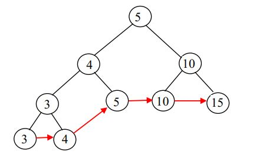
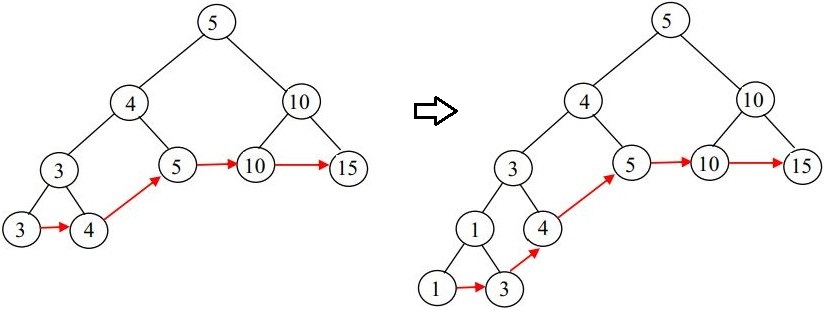
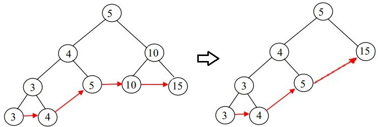

# Leaf-oriented binary search trees

Leaf-oriented binary search trees are an alternative implementation of the 'dictionary' abstract data type. They are defined as:

* Keys are stored in leaf nodes in non-decreasing order (left to right).
* All internal nodes store keys such that the following are always true:

  * The key of the left child of a node is less than or equal to the key of the node.

  * The key of the right child of a node is greater than the key of the node.

Note that the definition implies that all internal nodes always have two child nodes. Also, each leaf node has a pointer to the next leaf node.

Every leaf node corresponds to a (key, value) pair in the dictionary. To get the keys in increasing order, start from the leftmost leaf node and follow the next pointers until the last leaf node is reached.

An example of a leaf-oriented binary search tree is depicted below.

## Insert a new key

1. Find the parent leaf node V' (has key K') of the new node V (has key K).

2. Replace V' by a tree that consists of 3 nodes, a parent node and two child nodes. The key of both left child and V is defined as min(K, K'). The key of the right child is defined as the max(K, K').

3. Update the necessary pointers to the next leaf nodes.

In the example below, key 1 is inserted.

## Delete a key

1. Find the leaf node V that has the key that will be deleted. Also, find the parent node V' of V.

2. Delete both V and V' and connect the parent node of V' to the sibling of V.

3. Update the necessary pointers to the next leaf nodes.

In the example below, key 10 is deleted.

