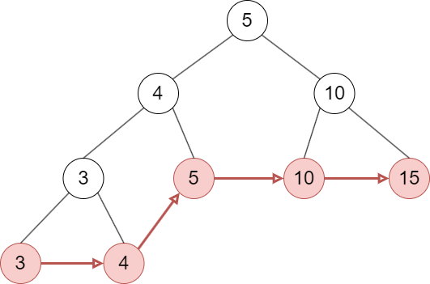
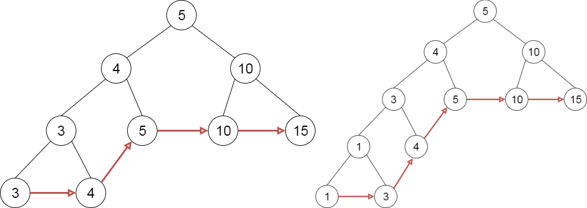
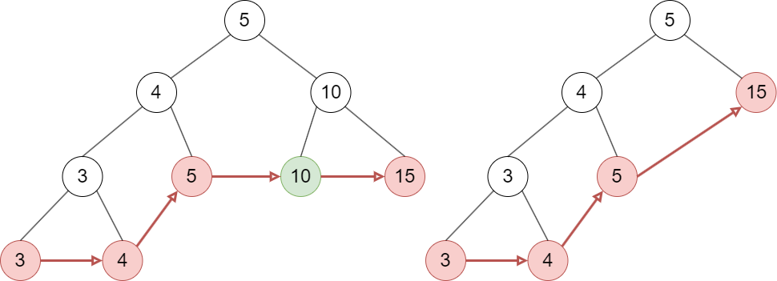
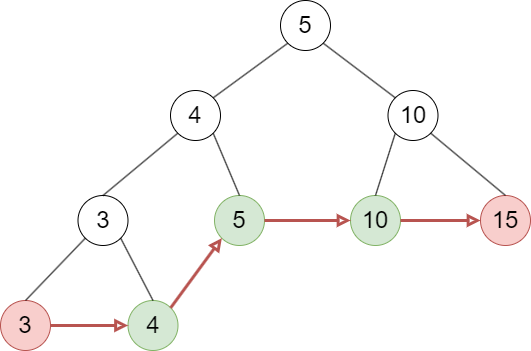

# Leaf-oriented binary search trees

Leaf-oriented binary search trees are an alternative implementation of the 'dictionary' abstract data type. They are defined as:

* Keys are stored in leaf nodes in non-decreasing order (left to right).
* All internal nodes store keys such that the following are always true:
  * The key of the left child of a node is less than or equal to the key of the node.
  * The key of the right child of a node is greater than the key of the node.

Note that the definition implies that internal nodes always have two child nodes. Also, each leaf node has a pointer to the next leaf node.

Every leaf node corresponds to a (key, value) pair in the dictionary. To get the keys in increasing order, start from the leftmost leaf node and follow the next pointers until the last leaf node is reached.

An example of a leaf-oriented binary search tree is depicted below.

## Insert a new key

1. Traverse the tree and find the parent leaf node L (has key Lk) of the new node C (has key Ck).
2. Replace L by a tree that consists of 3 nodes, a parent node and two child nodes. The key of the left child and the parent node is defined as min(Lk, Ck). The key of the right child is defined as max(Lk, Ck).
3. Update the necessary pointers to the next leaf nodes.

**Example**: key 9 is inserted.

## Delete a key

1. Traverse the tree and find the leaf node L that has the key that will be deleted. Also, find its parent node P.
2. Delete both L and P and connect the parent node of P to the sibling of L.
3. Update the necessary pointers to the next leaf nodes.

**Example**: key 10 is deleted.

## Range query (A to B)

1. Traverse the tree and find the last leaf node with key K that satisfies K <= key of A.
2. Traverse the leaf nodes until a key > B is found.

**Example**: range_query(4, 11)

